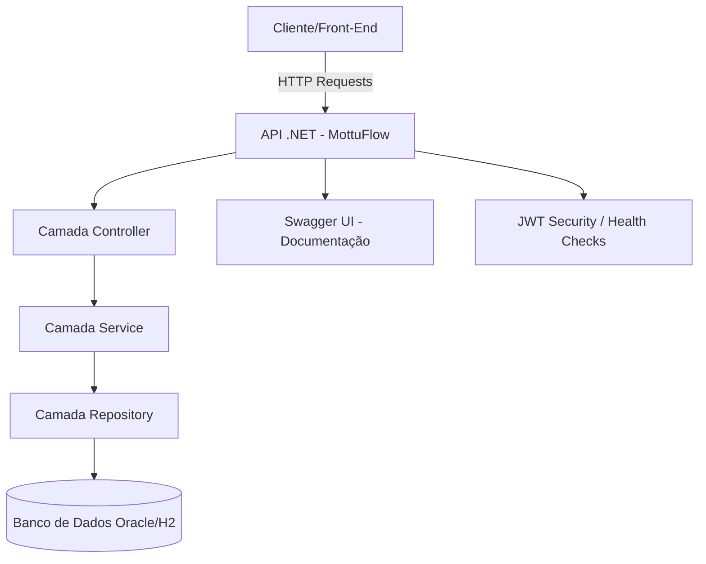

<div align="center">
  
  
  <h1><i><b>MottuFlow</b></i> - Sprint 4 (FIAP)</h1>
  <p><b>Disciplina:</b> Advanced Business Development with .NET</p>
  <p>API RESTful desenvolvida em .NET 8 para o gerenciamento inteligente de frotas de motocicletas da empresa <b>Mottu</b>.</p>
</div>

---

## 🏷️ Etiquetas
[](https://dotnet.microsoft.com/)
[](https://learn.microsoft.com/aspnet/core)
[](https://learn.microsoft.com/ef/)
[](https://choosealicense.com/licenses/mit/)
[](https://www.fiap.com.br/)

---

## 🎯 Visão Geral

O **MottuFlow** é uma API RESTful desenvolvida para otimizar o **gerenciamento de frotas de motocicletas** da empresa **Mottu**.  
A solução permite o controle completo de **funcionários, pátios, motos, câmeras, ArUco Tags, registros de status e localidades**.

O projeto aplica **boas práticas REST**, **HATEOAS**, **autenticação JWT**, **Health Checks**, **versionamento de API**, e inclui **testes unitários com xUnit**.

---

## 🧠 Arquitetura do Sistema

O projeto segue uma arquitetura em camadas (Controller → Service → Repository → Data → Model), garantindo modularidade e manutenibilidade.

### 🧩 Diagrama C4 (Alto Nível)



---

## ⚙️ Funcionalidades Principais

- ✅ CRUD completo para todas as entidades (Funcionário, Pátio, Moto, etc.)
- 🔗 **HATEOAS** integrado em todas as respostas
- 🔒 **Autenticação via JWT Token**
- ❤️ **Health Check Endpoint**
- 🧩 **Versionamento de API** (v1, v2)
- 📊 **Swagger/OpenAPI** com descrições detalhadas
- 🧠 **Integração ML.NET** (classificação de status de motos)
- 🧪 **Testes com xUnit** e **WebApplicationFactory**

---

## 🧰 Tecnologias Utilizadas

- **.NET 8 / ASP.NET Core Web API**
- **Entity Framework Core**
- **Swagger / Swashbuckle**
- **ML.NET**
- **xUnit**
- **HATEOAS**
- **JWT Authentication**
- **Oracle / H2 Database**

---

## 🧩 Documentação da API

### 🔹 Health Check
```http
GET /api/health/ping
```
**Resposta:**
```json
{
  "status": "API rodando 🚀"
}
```

---

### 🔹 Funcionários

| Método | Endpoint | Descrição |
|--------|-----------|-----------|
| `GET` | `/api/funcionarios` | Lista todos os funcionários |
| `GET` | `/api/funcionarios/{id}` | Retorna um funcionário específico |
| `POST` | `/api/funcionarios` | Cria um novo funcionário |
| `PUT` | `/api/funcionarios/{id}` | Atualiza dados de um funcionário |
| `DELETE` | `/api/funcionarios/{id}` | Remove um funcionário |

**Exemplo de resposta com HATEOAS:**
```json
{
  "id": 1,
  "nome": "João Silva",
  "cpf": "123.456.789-00",
  "links": [
    { "rel": "self", "href": "/api/funcionarios/1", "method": "GET" },
    { "rel": "update", "href": "/api/funcionarios/1", "method": "PUT" },
    { "rel": "delete", "href": "/api/funcionarios/1", "method": "DELETE" }
  ]
}
```

---

## 🧪 Testes Automatizados

### Rodando os testes com **xUnit**
```bash
dotnet test
```

Os testes cobrem:
- Lógica de negócio dos services;
- Integração básica via `WebApplicationFactory`;
- Validação de endpoints e códigos HTTP.

---

## 💻 Execução Local

### Clonar o projeto
```bash
git clone https://github.com/leomotalima/MottuFlow-Sprint4.git
```

### Entrar no diretório
```bash
cd MottuFlow-Sprint4
```

### Restaurar dependências
```bash
dotnet restore
```

### Rodar a aplicação
```bash
dotnet run
```

Acesse: [http://localhost:5224/swagger]

---

## ⚙️ Configuração do Banco de Dados

O projeto suporta **dois tipos de banco**: **H2 em memória** (para desenvolvimento/testes) e **Oracle Database** (recomendado para produção).  

### 1️⃣ H2 Database (em memória)  
- Não requer configuração adicional.  
- Ideal para testes rápidos e desenvolvimento local.  
- Para usar H2, configure no `appsettings.json`:

```json
{
  "UseInMemoryDatabase": true
}
```

### 2️⃣ Oracle Database (recomendado)  
- Configure `UseInMemoryDatabase` como `false` e adicione a string de conexão no `appsettings.json` ou via **variáveis de ambiente**:

```json
{
  "UseInMemoryDatabase": false,
  "ConnectionStrings": {
    "OracleDb": "User Id=SEU_USUARIO;Password=SUA_SENHA;Data Source=(DESCRIPTION=(ADDRESS=(PROTOCOL=TCP)(HOST=SEU_HOST)(PORT=1521))(CONNECT_DATA=(SERVICE_NAME=SEU_SERVICO)))"
  }
}
```

- Certifique-se de que o **banco Oracle esteja rodando**.  
- Caso existam **migrations**, execute:

```bash
dotnet ef database update
```

### 🔹 Alternando via Variáveis de Ambiente (opcional)

Você pode sobrescrever `UseInMemoryDatabase` sem alterar o `appsettings.json`:

- **Windows (PowerShell):**
```powershell
$env:UseInMemoryDatabase="false"
dotnet run
```

- **Linux / MacOS (bash/zsh):**
```bash
export UseInMemoryDatabase=false
dotnet run
```

> 💡 Dica: é **recomendado utilizar Oracle** para validar todas as funcionalidades da API, pois ele representa o ambiente de produção.  
> 🔹 O uso de variáveis de ambiente facilita alternar entre H2 e Oracle em diferentes ambientes (desenvolvimento, testes e produção).

---

## 🧠 Aprendizados

Durante o desenvolvimento, foram aplicadas práticas avançadas de:
- Arquitetura em camadas e injeção de dependência;
- Versionamento e documentação de APIs;
- Segurança com JWT e boas práticas REST;
- Testes automatizados e integração contínua.

---

## 📜 Licença

Distribuído sob a licença **MIT**.  
Veja [LICENSE](https://choosealicense.com/licenses/mit/) para mais detalhes.

---

## 👥 Autores

| Nome | RM | Responsabilidade |
|------|----|------------------|
| **Léo Mota Lima** | 557851 | API REST, Controllers, DTOs, Swagger, HATEOAS, Testes |
| **João Gabriel Boaventura** | 557854 | Lógica de negócio e integração ML.NET |
| **Lucas Leal das Chagas** | 551124 | Documentação, banco de dados e versionamento |

---

## 🔗 Referências

- [Microsoft Docs – ASP.NET Core Web API](https://learn.microsoft.com/aspnet/core/)
- [Awesome README Templates](https://awesomeopensource.com/project/elangosundar/awesome-README-templates)
- [Swagger Documentation Best Practices](https://swagger.io/resources/articles/best-practices-in-api-documentation/)
- [Mermaid C4 Diagrams](https://mermaid.js.org/syntax/c4.html)

