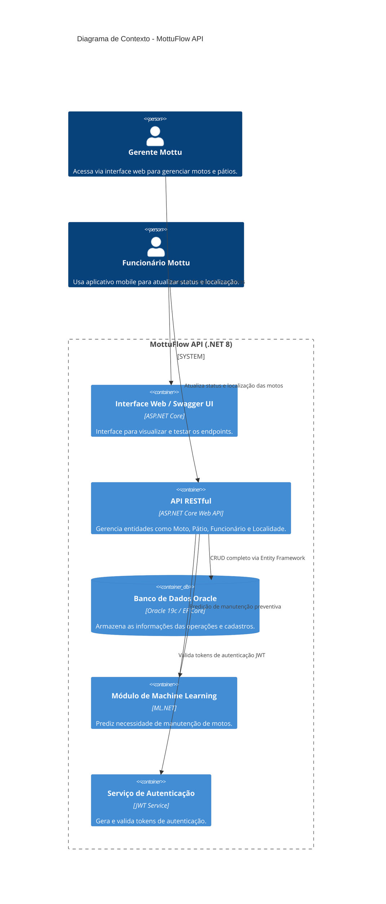
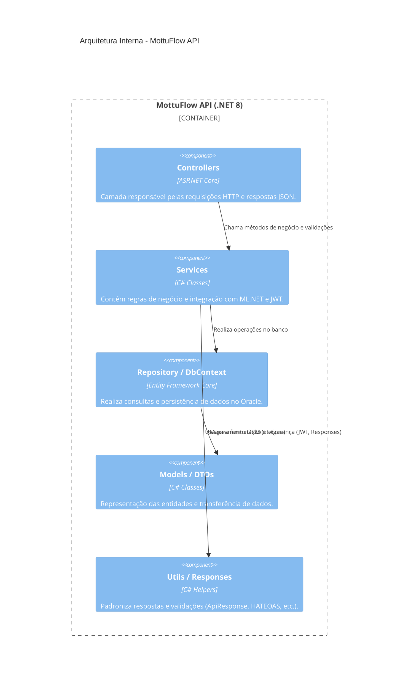

<div align="center">
  
  <h1><i><b>MottuFlow</b></i> - Sprint 4 (FIAP)</h1>
  <p><b>Disciplina:</b> Advanced Business Development with .NET</p>
  <p><b>Professor Orientador:</b> Leonardo Gasparini Romão</p>
  <p>API RESTful desenvolvida em .NET 8 para o gerenciamento inteligente de frotas de motocicletas da empresa <b>Mottu</b>.</p>
</div>

---

## 🏷️ Etiquetas
[](https://dotnet.microsoft.com/)
[](https://learn.microsoft.com/aspnet/core)
[](https://learn.microsoft.com/ef/)
[](https://choosealicense.com/licenses/mit/)
[](https://www.fiap.com.br/)

---

## 🎯 Visão Geral

O **MottuFlow** é uma **API RESTful** desenvolvida para otimizar o **gerenciamento inteligente de frotas de motocicletas** da empresa **Mottu**.

A solução oferece controle completo sobre **funcionários, pátios, motos, câmeras, ArUco Tags, registros de status e localidades**,  
proporcionando **eficiência operacional**, **automação de processos** e **monitoramento centralizado** por meio de boas práticas REST e integração moderna com banco de dados.

O projeto aplica **boas práticas REST**, **HATEOAS**, **autenticação JWT**, **Health Checks**, **versionamento de API**, e inclui **testes unitários e de integração com xUnit**.

> 💡 Este projeto foi desenvolvido como parte da disciplina **Advanced Business Development with .NET** da **FIAP**, aplicando conceitos modernos de arquitetura, segurança e testes em APIs RESTful corporativas.

---

## 🧠 Arquitetura do Sistema

O **MottuFlow** segue uma **arquitetura em camadas (Controller → Service → Repository → Data → Model)**, baseada em boas práticas de **Domain-Driven Design (DDD)** e princípios **SOLID**.  
Essa estrutura garante modularidade, facilidade de manutenção e escalabilidade.

---

### 🧩 Diagrama C4 (Alto Nível)



---

### 🧱 Arquitetura Interna (Component Diagram)



---

## 🚀 Demonstração de Uso da API

A seguir estão exemplos reais de chamadas aos principais endpoints da **MottuFlow API**, utilizando **Swagger**, **cURL** e **arquivos `.http`** (Visual Studio / VS Code).

---

### 🔹 1️⃣ Autenticação - Login

```http
POST /api/auth/login
Content-Type: application/json

{
  "email": "admin@mottu.com",
  "senha": "123456"
}
```

**Resposta (200 OK):**
```json
{
  "token": "eyJhbGciOiJIUzI1NiIsInR5cCI6IkpXVCJ9...",
  "tipo": "Bearer",
  "expiraEm": "2025-12-31T23:59:59Z"
}
```

> 💡 O token JWT retornado deve ser utilizado no cabeçalho das requisições autenticadas:  
> `Authorization: Bearer <seu_token_jwt>`

---

### 🔹 2️⃣ Cadastro de Moto

```http
POST /api/motos
Authorization: Bearer <token>
Content-Type: application/json

{
  "placa": "ABC-1234",
  "modelo": "Honda CG 160",
  "fabricante": "Honda",
  "ano": 2023,
  "idPatio": 1,
  "localizacaoAtual": "Zona Leste - SP"
}
```

**Resposta (201 Created):**
```json
{
  "id": 7,
  "placa": "ABC-1234",
  "modelo": "Honda CG 160",
  "fabricante": "Honda",
  "ano": 2023,
  "status": "Disponível",
  "links": [
    { "rel": "self", "href": "/api/motos/7", "method": "GET" },
    { "rel": "update", "href": "/api/motos/7", "method": "PUT" },
    { "rel": "delete", "href": "/api/motos/7", "method": "DELETE" }
  ]
}
```

---

### 🔹 3️⃣ Listagem de Funcionários

```http
GET /api/funcionarios
Authorization: Bearer <token>
```

**Resposta (200 OK):**
```json
[
  {
    "idFuncionario": 1,
    "nome": "João Silva",
    "cpf": "123.456.789-00",
    "cargo": "Supervisor de Pátio",
    "telefone": "(11) 99999-0000",
    "email": "joao.silva@mottu.com"
  },
  {
    "idFuncionario": 2,
    "nome": "Maria Santos",
    "cpf": "987.654.321-00",
    "cargo": "Operadora de Campo",
    "telefone": "(11) 98888-1111",
    "email": "maria.santos@mottu.com"
  }
]
```

---

### 🔹 4️⃣ Predição de Manutenção (ML.NET)

```http
POST /api/ml/predicao
Content-Type: application/json

{
  "quilometragem": 7500,
  "tempoUsoMeses": 8
}
```

**Resposta (200 OK):**
```json
{
  "precisaManutencao": true,
  "probabilidade": 0.89,
  "modelo": "ML.NET Binary Classification"
}
```

---

### 🔹 5️⃣ Health Check

```http
GET /api/health/ping
```

**Resposta:**
```json
{
  "status": "API rodando 🚀"
}
```

---

### 💡 Dica para Testes Locais

Você pode testar todos os endpoints diretamente pelo **Swagger UI** acessando:
```
http://localhost:5224/swagger
```

Ou criar um arquivo `.http` para testar via **VS Code**:

```http
### Teste de Health Check
GET http://localhost:5224/api/health/ping

### Teste de Login
POST http://localhost:5224/api/auth/login
Content-Type: application/json

{
  "email": "admin@mottu.com",
  "senha": "123456"
}

### Teste de Cadastro de Moto
POST http://localhost:5224/api/motos
Authorization: Bearer {{token}}
Content-Type: application/json

{
  "placa": "DEF-5678",
  "modelo": "Yamaha Factor",
  "fabricante": "Yamaha",
  "ano": 2022,
  "idPatio": 2,
  "localizacaoAtual": "Zona Norte - SP"
}
```

---

## 👥 Autores

| Nome | RM | Responsabilidade |
|------|----|------------------|
| **Léo Mota Lima** | 557851 | API REST, Controllers, DTOs, Swagger, HATEOAS, Testes |
| **João Gabriel Boaventura** | 557854 | Lógica de negócio e integração ML.NET |
| **Lucas Leal das Chagas** | 551124 | Documentação, banco de dados e versionamento |
