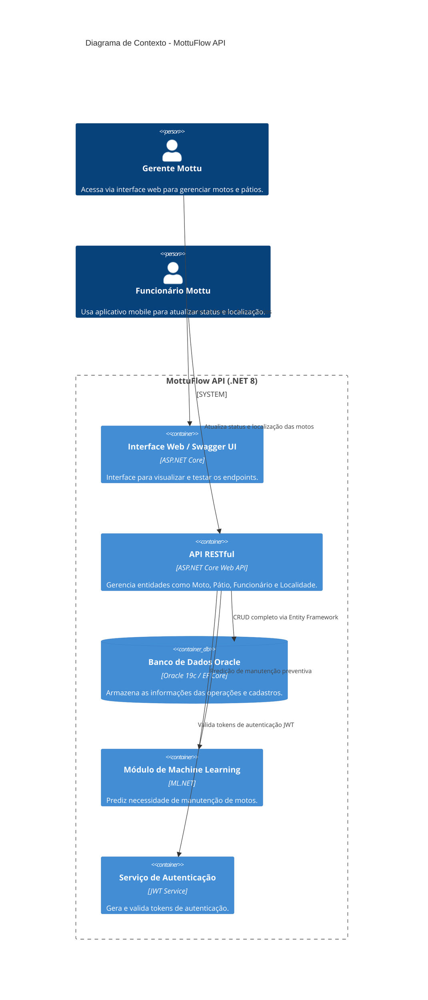
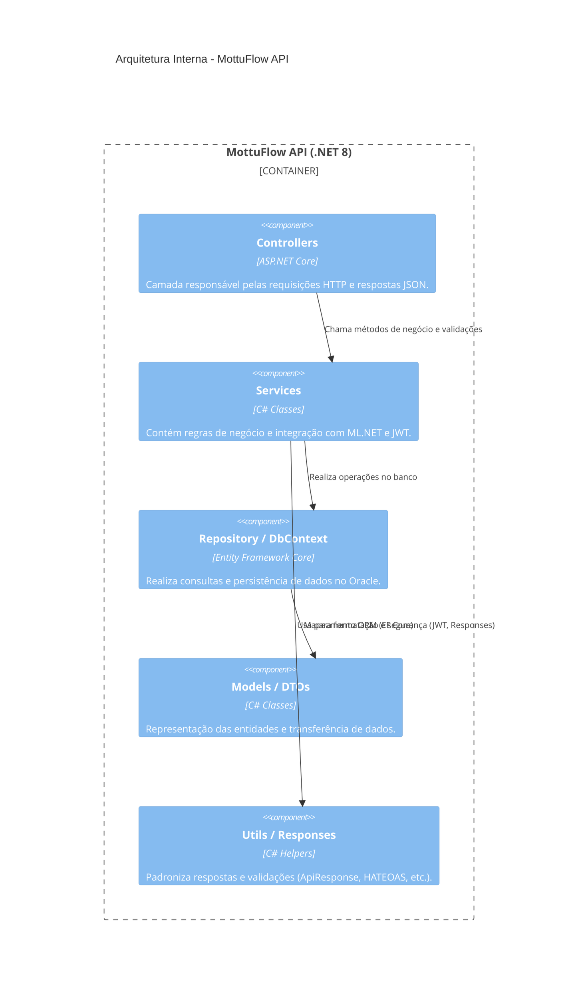

<div align="center">
  
  <h1>𝙈𝙤𝙩𝙩𝙪𝙁𝙡𝙤𝙬</h1>
</div>
  
  <h1><i><b>MottuFlow</b></i> - Sprint 4 (FIAP)</h1>
  <p><b>Disciplina:</b> Advanced Business Development with .NET</p>
  <p><b>Professor Orientador:</b> Leonardo Gasparini Romão </p>
  <p>API RESTful desenvolvida em .NET 8 para o gerenciamento inteligente de frotas de motocicletas da empresa <b>Mottu</b>.</p>
</div>

---

## 🏷️ Etiquetas
[](https://dotnet.microsoft.com/)
[](https://learn.microsoft.com/aspnet/core)
[](https://learn.microsoft.com/ef/)
[](https://choosealicense.com/licenses/mit/)
[](https://www.fiap.com.br/)

---

## 🎯 Visão Geral

O **MottuFlow** é uma **API RESTful** desenvolvida para otimizar o **gerenciamento inteligente de frotas de motocicletas** da empresa **Mottu**.

A solução oferece controle completo sobre **funcionários, pátios, motos, câmeras, ArUco Tags, registros de status e localidades**,  
proporcionando **eficiência operacional**, **automação de processos** e **monitoramento centralizado** por meio de boas práticas REST e integração moderna com banco de dados.

O projeto aplica **boas práticas REST**, **HATEOAS**, **autenticação JWT**, **Health Checks**, **versionamento de API**, e inclui **testes unitários e de integração com xUnit**.

> 💡 Este projeto foi desenvolvido como parte da disciplina **Advanced Business Development with .NET** da **FIAP**, aplicando conceitos modernos de arquitetura, segurança e testes em APIs RESTful corporativas.

---

## 🧠 Arquitetura do Sistema

O **MottuFlow** segue uma **arquitetura em camadas (Controller → Service → Repository → Data → Model)**, baseada em boas práticas de **Domain-Driven Design (DDD)** e princípios **SOLID**.  
Essa estrutura garante modularidade, facilidade de manutenção e escalabilidade.

---

### 🧩 Diagrama C4 (Alto Nível)



---

### 🧱 Arquitetura Interna (Component Diagram)



---

### 📦 Resumo da Arquitetura

| Camada | Função Principal |
|---------|------------------|
| **Controller** | Expõe endpoints REST e retorna respostas HTTP/JSON |
| **Service** | Contém as regras de negócio e integrações (ML.NET, JWT) |
| **Repository / Data** | Gerencia persistência via Entity Framework Core |
| **Model / DTO** | Define entidades e objetos de transferência de dados |
| **Utils** | Oferece respostas padronizadas, validações e segurança |
| **Swagger / HealthChecks** | Documentação e monitoramento da API |

---

### 💡 Destaques Técnicos
- ✅ **Autenticação JWT** com controle de acesso por `[Authorize]`
- ✅ **Versionamento de API** via `ApiVersioning`
- ✅ **Swagger/OpenAPI 3.0** com anotações e segurança configurada
- ✅ **Health Checks** para observabilidade
- ✅ **HATEOAS** implementado em todas as respostas
- ✅ **Machine Learning (ML.NET)** integrado ao endpoint `/api/v1/ml/predicao`
- ✅ **Testes automatizados com xUnit e WebApplicationFactory`

---

## ⚙️ Funcionalidades Principais

- ✅ CRUD completo para todas as entidades (Funcionário, Pátio, Moto, etc.)
- 🔗 **HATEOAS** integrado em todas as respostas
- 🔒 **Autenticação via JWT Token**
- ❤️ **Health Check Endpoint**
- 🧩 **Versionamento de API** (v1, v2)
- 📊 **Swagger/OpenAPI** com descrições detalhadas
- 🧠 **Integração ML.NET** (classificação de status de motos)
- 🧪 **Testes com xUnit e WebApplicationFactory**

---

## 🧰 Tecnologias Utilizadas

- **.NET 8 / ASP.NET Core Web API**
- **Entity Framework Core**
- **Swagger / Swashbuckle**
- **ML.NET**
- **xUnit**
- **HATEOAS**
- **JWT Authentication**
- **Oracle / InMemory Database (EF Core)**

---

## 💻 Execução Local

### Clonar o projeto
```bash
git clone https://github.com/leomotalima/MottuFlow-Sprint4.git
cd MottuFlow-Sprint4
dotnet restore
dotnet run
```
Acesse: http://localhost:5224/swagger

---

## 📜 Licença

Distribuído sob a licença **MIT**.  
Veja [LICENSE](https://choosealicense.com/licenses/mit/) para mais detalhes.

---

## 👥 Autores

| Nome | RM | Responsabilidade |
|------|----|------------------|
| **Léo Mota Lima** | 557851 | API REST, Controllers, DTOs, Swagger, HATEOAS, Testes |
| **João Gabriel Boaventura** | 557854 | Lógica de negócio e integração ML.NET |
| **Lucas Leal das Chagas** | 551124 | Documentação, banco de dados e versionamento |
