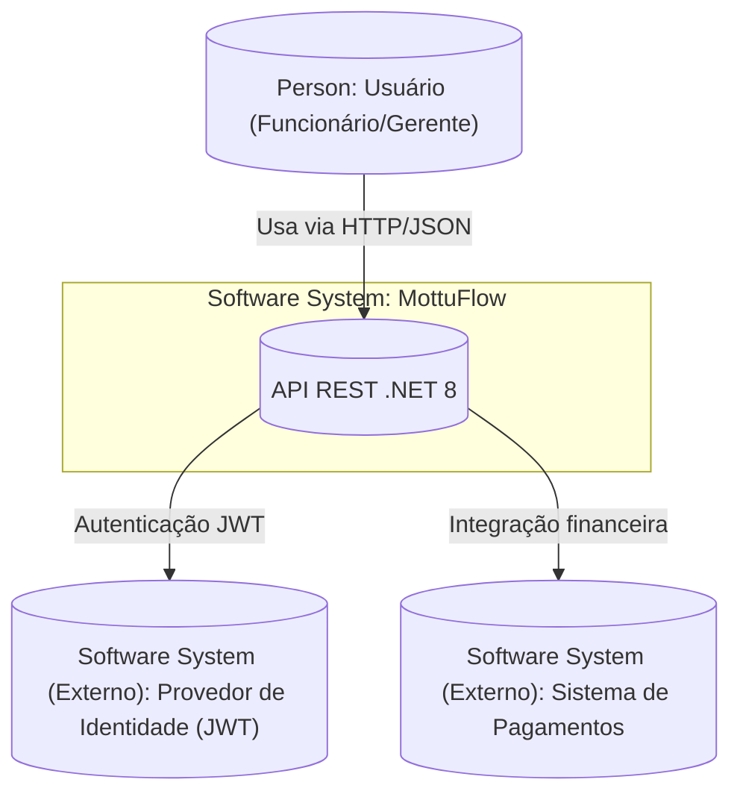

<div align="center">
  
  
  <h1><i><b>MottuFlow</b></i> - Sprint 4 (FIAP)</h1>
  <p><b>Disciplina:</b> Advanced Business Development with .NET</p>
  <p><b>Professor Orientador:</b> Leonardo Gasparini Romão</p>
  <p>API RESTful desenvolvida em <b>.NET 8</b> para o gerenciamento inteligente de frotas de motocicletas da empresa <b>Mottu</b>.</p>
</div>

---

## Etiquetas

[](https://dotnet.microsoft.com/)
[](https://learn.microsoft.com/aspnet/core)
[](https://learn.microsoft.com/ef/)
[](https://choosealicense.com/licenses/mit/)
[](https://www.fiap.com.br/)

---

## Visão Geral

O **MottuFlow** é uma **API RESTful** desenvolvida para otimizar o **gerenciamento inteligente de frotas de motocicletas** da empresa **Mottu**.  
A solução oferece controle completo sobre **funcionários, pátios, motos, câmeras, ArUco Tags, registros de status e localidades**, proporcionando **eficiência operacional**, **automação de processos** e **monitoramento centralizado** com boas práticas REST e integração com **Oracle**.

A aplicação implementa **autenticação JWT**, **HATEOAS**, **Health Checks**, **versionamento de API**, e testes automatizados com **xUnit** e **WebApplicationFactory**.

> Projeto desenvolvido para a disciplina **Advanced Business Development with .NET**, aplicando conceitos modernos de arquitetura, segurança e testes em APIs RESTful corporativas.

---

## Arquitetura do Sistema

O projeto segue uma arquitetura em camadas (Controller → Service → Repository → Data → Model), garantindo modularidade e manutenibilidade.

---

### C4-1: System Context (Visão de Contexto)



> Mostra o relacionamento entre o usuário e os sistemas externos que interagem com o MottuFlow.

---

### C4-2: Container (Visão de Contêineres)

```mermaid
graph TB
    subgraph MottuFlow ["Software System: MottuFlow"]
      api[("Container: API .NET 8 (ASP.NET Core)") ]
      service[("Container: Services (Lógica de Negócio)") ]
      repo[("Container: Repositories (Acesso a Dados)") ]
      db[(("Container: Database (Oracle / InMemory)"))]
      swagger[("Container: Swagger UI (OpenAPI)") ]
      health[("Container: Health Checks") ]
      ml[("Container: ML.NET Engine (Previsão de Manutenção)") ]
    end

    user[("Container (Externo): Front-End Web/Mobile")]
    idp[("Container (Externo): Provedor de Identidade JWT")]

    user -->|HTTP/JSON| api
    api --> service
    service --> repo
    repo -->|EF Core| db
    api --> swagger
    api --> health
    service --> ml
    api -->|Autenticação| idp
```

> Representa os principais contêineres internos e suas relações de comunicação dentro do sistema MottuFlow.

---

### C4-3: Component (Visão de Componentes da API - Exemplo Domínio “Moto”)

```mermaid
graph LR
    ctrl[("Component: MotoController (Endpoints REST)") ]
    svc[("Component: MotoService (Regras de Negócio)") ]
    repo[("Component: MotoRepository (Acesso a Dados)") ]
    mapper[("Component: MotoMapper (Conversão DTO ⇄ Entidade)") ]
    validator[("Component: MotoValidator (Validação de Dados)") ]
    db[(("Container: Banco de Dados (Oracle/InMemory)"))]

    ctrl -->|Chama| svc
    svc -->|Usa| repo
    svc -->|Usa| mapper
    svc -->|Usa| validator
    repo -->|CRUD/Queries| db
```

> Mostra os principais componentes internos do container da API para o domínio de **Moto**.

## Funcionalidades Principais

- CRUD completo para Funcionário, Pátio, Moto, etc.  
- Autenticação JWT e proteção de endpoints  
- HATEOAS em todas as respostas  
- Versionamento de API (v1, v2)  
- Health Check (`/api/health/ping`)  
- Swagger/OpenAPI documentado com anotações  
- Integração ML.NET (classificação de status de motos)  
- Testes automatizados com xUnit

---

## Tecnologias Utilizadas

| Tecnologia | Descrição |
|-------------|------------|
| **.NET 8 / ASP.NET Core** | Framework principal da API |
| **Entity Framework Core** | ORM para Oracle e InMemory |
| **Swagger / Swashbuckle** | Documentação interativa da API |
| **JWT Bearer** | Autenticação e segurança |
| **ML.NET** | Previsão de manutenção |
| **xUnit** | Testes de unidade e integração |
| **HATEOAS** | Navegação via links semânticos |
| **Oracle / InMemory** | Suporte a múltiplos bancos de dados |

---

## Testes Automatizados


- Banco InMemory criado e inicializado corretamente  
- Endpoints retornando status HTTP esperados (200, 201, 404 etc.)  
- Separação entre ambientes Oracle (produção) e InMemory (testes)  
- Testes de autenticação JWT validados com sucesso  

**Executando os testes manualmente:**
```bash
dotnet clean
dotnet build
dotnet test
```
> Todos os testes rodam com banco **InMemory**, sem necessidade do Oracle local.

---

## Estrutura do Projeto

```
MottuFlow-Sprint4/
├── Controllers/
├── Data/
├── DTOs/
├── Hateoas/
├── Models/
├── Repositories/
├── Services/
├── Swagger/
├── MottuFlow.Tests/
├── Program.cs
└── README.md
```

---

## Execução Local

```bash
git clone https://github.com/leomotalima/MottuFlow-Sprint4.git
cd MottuFlow-Sprint4
dotnet restore
dotnet run
```

Acesse: [https://localhost:5001/swagger](https://localhost:5001/swagger)

---

## Aprendizados

Durante o desenvolvimento foram aplicadas:
- Arquitetura em camadas e injeção de dependência  
- Versionamento e documentação de APIs  
- Segurança com JWT e boas práticas REST  
- Testes automatizados e integração contínua  

---

## Autores

| Nome | RM | Responsabilidade |
|------|----|------------------|
| **Léo Mota Lima** | 557851 | API, Controllers, DTOs, Swagger, HATEOAS, Testes |
| **João Gabriel Boaventura** | 557854 | Lógica de Negócio e ML.NET |
| **Lucas Leal das Chagas** | 551124 | Documentação, Banco de Dados, Versionamento |

---

## Licença

Distribuído sob a licença **MIT**.  
Consulte [LICENSE](https://choosealicense.com/licenses/mit/).

---

## Referências

- [Microsoft Docs – ASP.NET Core Web API](https://learn.microsoft.com/aspnet/core/)
- [C4 Model Website](https://c4model.com/diagrams)
- [Swagger Best Practices](https://swagger.io/resources/articles/best-practices-in-api-documentation/)
- [Mermaid C4 Diagrams](https://mermaid.js.org/syntax/c4.html)
